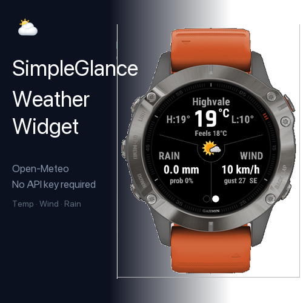
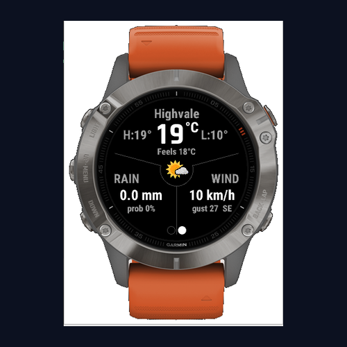
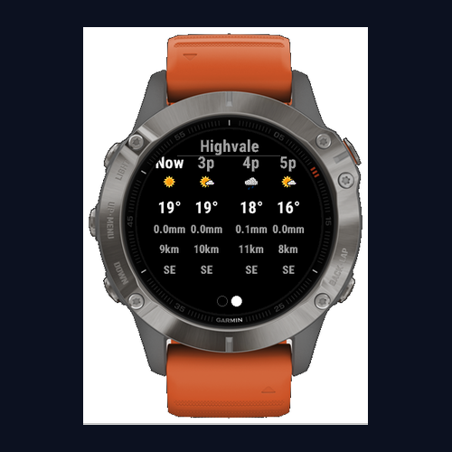
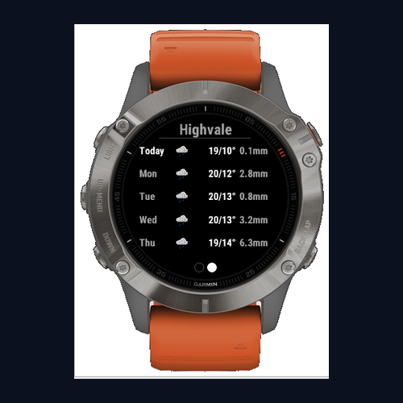
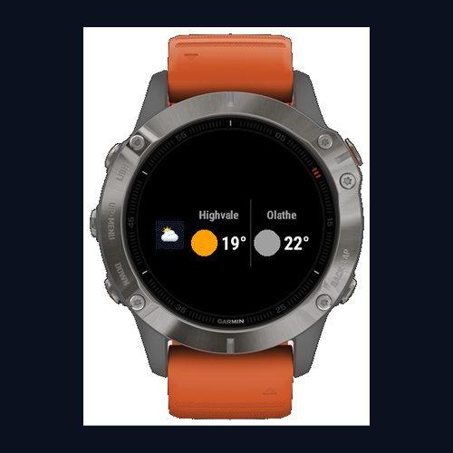

# SimpleGlance Weather Widget (Open-Meteo)



A clean, minimal weather widget for Garmin Fenix watches. Displays live conditions for two locations — your current GPS position and a configurable home location — with a single button toggle between them. Until you set a home location, the Home page simply mirrors your current GPS location instead of showing a placeholder town.

| Current Conditions | Hourly Forecast | Daily Forecast | Glance |
|:---:|:---:|:---:|:---:|
|  |  |  |  |

## Features

- Radial watch face layout — temperature (top), rain (bottom-left), wind (bottom-right)
- Temperature and feels-like temperature
- Wind speed, gust, direction arrow and compass label
- Rainfall (mm, current hour)
- **Hourly forecast** — weather icon, temperature, rain (mm), wind speed and direction for Now + 3 hours ahead
- **Daily forecast** — weather icon, high/low temperature, wind and rain for Today + 4 days ahead
- Two-location toggle (GPS ↔ Home) with indicator dots showing active location
- **Glance view** — two-column strip showing Home (left) and GPS (right), each with condition indicator and current temperature
- Background refresh on a configurable interval (15 / 30 / 60 min)
- Offline cache — last known data shown instantly on launch
- No API key required — powered by [Open-Meteo](https://open-meteo.com) (free, no sign-up)

## Supported Devices

Fenix 6, Fenix 6 Pro, Fenix 6S, Fenix 6S Pro

## Navigation

| Button | Action |
|--------|--------|
| UP / DOWN | Cycle through pages: Current Conditions → Hourly → Daily |
| SELECT | Toggle between GPS location and home location |
| MENU | Force refresh weather data |

The two dots at the bottom of the current-conditions screen indicate the active location: left dot = GPS, right dot = Home.

## Settings

| Setting | Default | Options |
|---------|---------|---------|
| Background Refresh Interval | 30 min | 15 / 30 / 60 min |
| Home Latitude | -27.3705 (unconfigured) | Decimal degrees (e.g. -27.3705) |
| Home Longitude | 152.8691 (unconfigured) | Decimal degrees (e.g. 152.8691) |

The Latitude/Longitude defaults above are a sentinel, not a real location — until you change *both* values, the widget treats Home as unconfigured and mirrors your GPS location there instead of geocoding the default coordinates.

Change settings via the **Garmin Connect app** on your phone → My Device → Apps & Widgets → SimpleGlance Weather Widget.

## Architecture

**BackgroundService.mc** — Runs on a timer even when the widget is closed. Fetches weather from Open-Meteo for both GPS and home locations, parses responses into compact arrays, and passes them to `WeatherApp` via `Background.exit()`. Never draws anything.

**WeatherApp.mc** — App entry point and coordinator. Launches the initial view, schedules/re-schedules the background fetch timer, and receives data from `BackgroundService` — writing it into persistent `Storage` for `WeatherView` to consume. Re-schedules the timer and triggers a redraw when settings change.

**WeatherDelegate.mc** — Button handler. UP/DOWN cycles through three pages (current conditions → hourly forecast → daily forecast). SELECT toggles between GPS and home location. MENU forces an immediate data refresh. No drawing or networking.

**WeatherGlanceView.mc** — The small preview shown in the watch glance loop. Split into two columns: Home location (left) and GPS location (right). Each column shows a colour-coded condition dot and current temperature. No bitmap loading — uses drawing primitives only, as required by glance context restrictions.

**WeatherView.mc** — The full-screen widget UI. Fetches live data (with GPS fallback chain and retry logic), parses API responses, caches to `Storage`, and draws three pages: the current-conditions page (radial 3-sector layout with arc icon circle), the hourly forecast page (4 columns: Now + 3 hours, each with icon, temp, rain mm, wind), and the daily forecast page (5 rows: Today + 4 days, with icon, high/low temp, rain).

## Building

Requires the [Garmin Connect IQ SDK](https://developer.garmin.com/connect-iq/sdk/) (8.1+) and a developer key.

```bash
# Build for simulator
monkeyc -o bin/simpleglanceweatherwidget.prg -f monkey.jungle -y ~/.garmin_dev.der -d fenix6pro_sim -w

# Build package for all devices (upload to Connect IQ Store)
monkeyc -o bin/simpleglanceweatherwidget.iq --package-app -f monkey.jungle -y ~/.garmin_dev.der -w
```

Or use the [VS Code Monkey C extension](https://marketplace.visualstudio.com/items?itemName=garmin.monkey-c).

## Data Source

Weather data provided by [Open-Meteo](https://open-meteo.com) — free, no API key required.
Reverse geocoding provided by [Nominatim / OpenStreetMap](https://nominatim.openstreetmap.org) — free, no API key required.

## License

© 2026 Mahoneyclan. All rights reserved.
